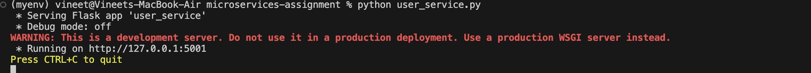
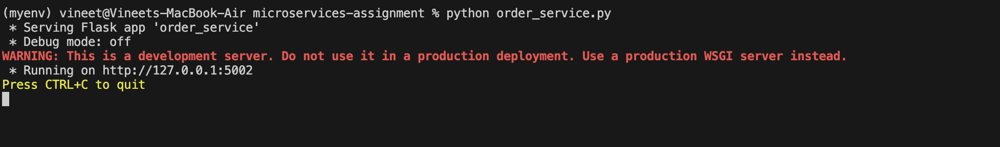
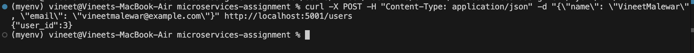
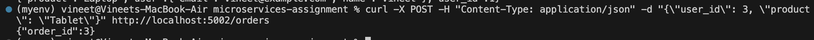

This project is a simple demonstration of a microservices architecture using Python and Flask.

It consists of two separate services: a User Service and an Order Service.


## Services

- **User Service (`user_service.py`):** Manages user data. Runs on port `5001`.
- **Order Service (`order_service.py`):** Manages order data and communicates with the User Service to retrieve user details. Runs on port `5002`.



## How to Run This Project

1.  **Clone the repository:**

    ```bash
    git clone [https://github.com/your-username/microservices-assignment.git](https://github.com/your-username/microservices-assignment.git)
    cd microservices-assignment
    ```

2.  **Create and activate a virtual environment:**

    ```bash
    python -m venv myenv
    # Activate on Windows: myenv\Scripts\Activate.ps1
    # Activate on macOS/Linux: source myenv/bin/activate
    ```

3.  **Install the dependencies:**

    ```bash
    pip install -r requirements.txt
    ```

4.  **Run the services (in two separate terminals):**
    - In Terminal 1: `python user_service.py`
    - In Terminal 2: `python order_service.py`

## Example API Requests

- **Get User with ID 1:**

  ```bash
  curl http://localhost:5001/users/1
  ```

  

- **Get Order with ID 1**

  ```bash
  curl http://localhost:5002/orders/1
  ```

  

- **Create a new user:**

```bash
  curl -X POST -H "Content-Type: application/json" -d "{\"name\": \"VineetMalewar\", \"email\": \"vineetmalewar@example.com\"}" http://localhost:5001/users
  ```



- **Create a new order:**
```bash 
curl -X POST -H "Content-Type: application/json" -d "{\"user_id\": 3, \"product\": \"Tablet\"}" http://localhost:5002/orders
```

